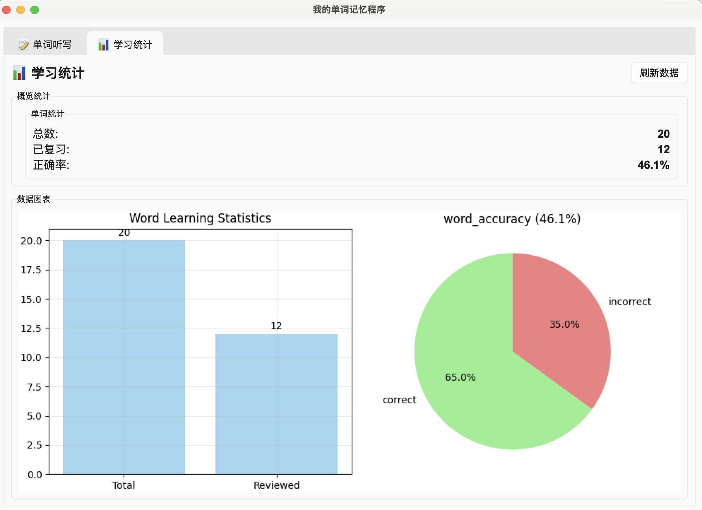

![[./assets/主页面.png]]





# 英语单词记忆系统 (Word Memorizer)

一个基于Python开发的智能英语单词学习系统，集成了听写练习和学习统计等功能。

## ✨ 主要特性

- 📝 **听写**: 支持英语单词的语音听写练习
- 🔊 **TTS**: 使用edge-tts实现高质量语音合成
- ✏️ **手动输入**: 手动输入模式，简化操作流程
- 📊 **学习统计**: 可视化学习进度和统计分析
- 🧠 **智能复习**: 基于SM-2算法的间隔重复学习

## 🔄 版本说明

单词学习功能：
- ✅ TTS语音播放（edge-tts）
- ✅ 文本输入模式
- ✅ 学习统计图表


## 🛠️ 技术栈

- **GUI框架**: Tkinter + sv-ttk (现代主题)
- **音频处理**: edge-tts, pygame
- **输入方式**: 键盘手动输入
- **数据可视化**: Matplotlib
- **数据存储**: JSON, CSV
- **算法**: SM-2间隔重复算法、堆、队列

## 📦 安装和运行

### 💾 下载可执行文件（推荐）

**🎯 最简单的使用方式：** 直接下载预编译的可执行文件，无需安装Python环境！

#### 📥 最新版本下载 (v2.1)

**Windows用户：**
- [📥 下载 WordMemorizer-Windows.zip](https://github.com/BillWang-dev/word_memorizer/releases/latest/download/WordMemorizer-Windows.zip)
- 解压后双击 `WordMemorizer.exe` 即可运行

**macOS用户：**  
- [📥 下载 WordMemorizer-macOS.zip](https://github.com/BillWang-dev/word_memorizer/releases/latest/download/WordMemorizer-macOS.zip)
- 解压后运行 `./WordMemorizer`（推荐使用终端运行）
- 首次运行可能需要在系统偏好设置→安全性中允许

**Linux用户：**
- [📥 下载 WordMemorizer-Linux.tar.gz](https://github.com/BillWang-dev/word_memorizer/releases/latest/download/WordMemorizer-Linux.tar.gz)
- 解压后运行 `./WordMemorizer`

> 💡 **优势**: 
> - ✅ 开箱即用，无需安装Python
> - ✅ 包含所有依赖库
> - ✅ 支持离线使用

### 📦 查看所有版本

访问 [GitHub Releases页面](https://github.com/BillWang-dev/word_memorizer/releases) 查看完整版本历史和更新日志。

### 💻 本地安装

#### 环境要求

- Python 3.8+
- 操作系统: Windows 10+, macOS 10.14+, Ubuntu 18.04+

#### 安装依赖

**注意**: 如果遇到"externally-managed-environment"错误，需要使用虚拟环境：

```bash
# 创建虚拟环境
python3 -m venv venv

# 激活虚拟环境
source venv/bin/activate  # Linux/macOS
# venv\Scripts\activate   # Windows
#.\venv\Scripts\activate.ps1 #如果Windows识别不了source
#Set-ExecutionPolicy -ExecutionPolicy Bypass -Scope Process

# 使用requirements文件
pip install -r requirements-basic.txt
```

#### 运行程序

```bash
python ui/main.py
```

## 📚 使用说明

### 1. 单词听写

1. 点击"单词听写"标签页
2. 点击"播放"按钮听取单词发音
3. 在文本框中手动输入听到的单词
4. 点击"提交答案"查看结果

### 2. 学习统计

- 查看总体学习进度
### 3. 自定义词书

- 支持导入CSV格式的单词文件
- 文件格式参考`data/`目录下的示例

## 📁 项目结构

```
WordMemorizer/
├── logic/              # 核心逻辑模块
│   └── core.py        # 词汇管理和复习调度
├── audio/              # 音频处理模块
│   └── listen.py      # TTS播放
├── ui/                 # 用户界面
│   └── main.py        # 主界面和交互
├── data/               # 数据文件
│   └── words_cet6.csv # 示例词汇
├── scripts/            # 构建脚本
│   └── build.py       # 打包脚本
└── requirements-basic.txt # 依赖列表
```

## 🔧 配置说明

### 数据文件格式

**单词CSV格式** (`words_cet6.csv`):
```csv
word,meaning,pronunciation,difficulty
abandon,放弃；抛弃,/əˈbændən/,2
```


## 📊 算法说明

### SM-2间隔重复算法

系统采用改进的SM-2算法来安排复习时间：

- **易度因子**: 根据回答质量动态调整
- **复习间隔**: 1天 → 6天 → 14天 → 递增
- **错误处理**: 答错时重置间隔，重新开始

### 文本相似度计算

使用词汇匹配度来评估听写准确性：
- 80%以上相似度认为正确
- 支持部分匹配和容错

## 🔍 故障排除

### 常见问题

1. **音频播放失败**
   - 检查系统音频设备
   - 确认pygame正确安装

2. **GUI启动失败**
   - 确保虚拟环境已激活
   - 检查所有依赖是否正确安装

3. **依赖安装失败**
   - 更新pip版本
   - 使用虚拟环境

## 📊 开发统计

- **总代码量**: ~1200行
- **核心模块**: 600行 (logic/)
- **音频引擎**: 200行 (audio/)
- **GUI界面**: 400行 (ui/)

## 📄 许可证

本项目为Python课程设计作品，仅供学习和教育用途使用。

## 🔗 相关链接

- [edge-tts项目](https://github.com/rany2/edge-tts)
- [Tkinter文档](https://docs.python.org/3/library/tkinter.html)

## 🚀 快速开始

```bash
# 克隆项目
git clone https://github.com/BillWang-dev/word_memorizer.git
cd word_memorizer

# 创建虚拟环境
python -m venv venv
source venv/bin/activate  # Linux/macOS
# venv\Scripts\activate   # Windows

# 安装依赖
pip install -r requirements-basic.txt

# 运行程序
python ui/main.py
```
